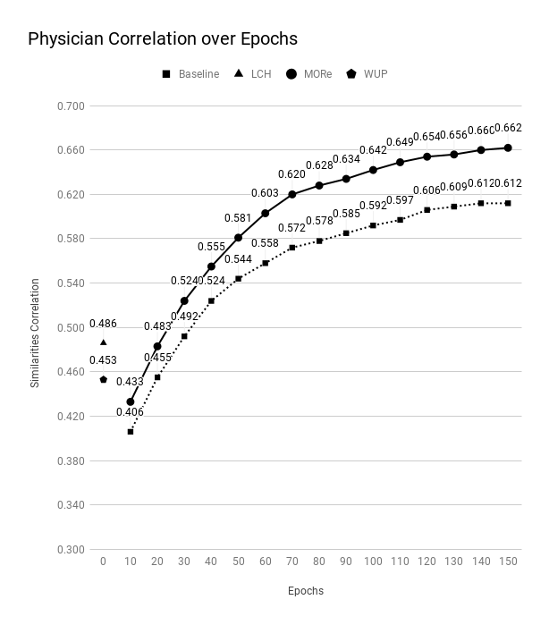
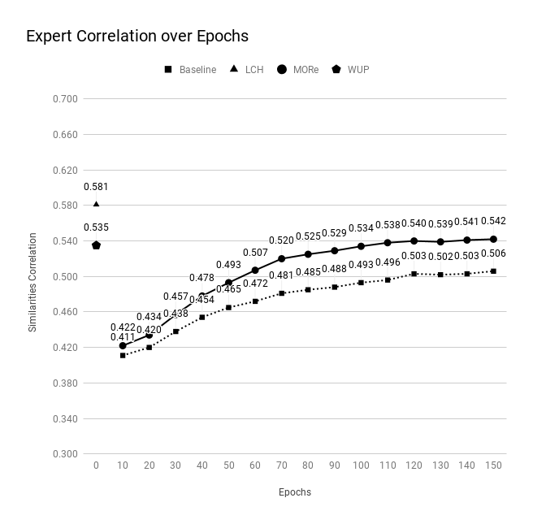

# Multi-Ontology Refined Embeddings (MORE): A Hybrid Multi-Ontology and Corpus-based Semantic Representation for Biomedical Concepts

By Steven Jiang and Saeed Hassanpour


## Dependencies
* [Python 3.6](https://www.anaconda.com/distribution/#macos)
* [Tensorflow](https://www.tensorflow.org/)
* [Scipy](https://www.scipy.org/)
* [Numpy](https://www.numpy.org/)
* [NLTK](https://www.nltk.org/)
* GPU

# Usage

## 1. Corpora
### RadCore
RadCore is a large multi-institutional radiology report corpus for NLP. RadCore contains 1,899,482 reports, collected between 1995 and 2006, from three major healthcare organizations: Mayo Clinic (812 reports), MD Anderson Cancer Center (5000 reports), and Medical College of Wisconsin (1,893,670 reports).

### MIMIC-III
Medical Information Mart for Intensive Care (MIMIC-III) is a database containing information gathered from patients that were admitted to critical care units at a large hospital. MIMIC-III also contains a gold standard corpus of 2,434 ICU nursing notes accessible [here](https://mimic.physionet.org/gettingstarted/access/).

```
MIMIC-III, a freely accessible critical care database. Johnson AEW, 
Pollard TJ, Shen L, Lehman L, Feng M, Ghassemi M, Moody B, Szolovits P, 
Celi LA, and Mark RG. Scientific Data (2016). DOI: 10.1038/sdata.2016.35. 
Available from: http://www.nature.com/articles/sdata201635
```


## 2. UMLS
UMLS-Interface is a Perl package that provides an API to a local installation of the UMLS in a MySQL database (available [here](https://metacpan.org/pod/UMLS::Interface)). UMLS-Similarity is a Perl package that provides an API and a command line program to obtain the semantic similarity between CUIs in the UMLS given a specified set of source(s) and relations (available [here](https://metacpan.org/pod/UMLS::Similarity)). UMLS-Similarity contains five semantic similarity measures proposed by Rada, et. al., Wu & Palmer, Leacock & Chodorow, and Nguyen & Al-Mubaid, and the Path measure.

Installation instructions available [here](http://www.d.umn.edu/~tpederse/umls-similarity.html).

```
McInnes, B. T., Pedersen, T., & Pakhomov, S. V. (2009). 
UMLS-Interface and UMLS-Similarity: open source software for measuring paths and semantic similarity. 
In AMIA Annual Symposium Proceedings (Vol. 2009, p. 431). 
American Medical Informatics Association.
```

## 3. word2vec skip-gram
Much of the code in this project is taken from and based off of the official Tensorflow implementation of the word2vec skip-gram model, which available on Github [here](https://github.com/tensorflow/models/tree/master/tutorials/embedding). The following instructions (copied from the above link) are for compiling the ops:

```
TF_CFLAGS=( $(python -c 'import tensorflow as tf; print(" ".join(tf.sysconfig.get_compile_flags()))') )
TF_LFLAGS=( $(python -c 'import tensorflow as tf; print(" ".join(tf.sysconfig.get_link_flags()))') )
g++ -std=c++11 -shared word2vec_ops.cc word2vec_kernels.cc -o word2vec_ops.so -fPIC ${TF_CFLAGS[@]} ${TF_LFLAGS[@]} -O2 -D_GLIBCXX_USE_CXX11_ABI=0
```

On Mac, add `-undefined dynamic_lookup` to the g++ command. The flag `-D_GLIBCXX_USE_CXX11_ABI=0` is included to support newer versions of gcc. However, if you compiled TensorFlow from source using gcc 5 or later, you may need to exclude the flag. Specifically, if you get an error similar to the following: `word2vec_ops.so: undefined symbol: _ZN10tensorflow7strings6StrCatERKNS0_8AlphaNumES3_S3_S3_` then you likely need to exclude the flag.

## 4. Preprocessing
### Corpora 
To preprocess the corpora, run the `process_file()` command in the `preprocess.py` file. The function returns the cleaned and tokenized text in a list and also prints the output. If no other preprocessing is required, simply cat the output to a .txt file.

### Matrices
To generate the similarity matrices, simply run the `umls-similarity.pl` script (available [here](https://metacpan.org/pod/distribution/UMLS-Similarity/utils/umls-similarity.pl)) with the `--matrix` and `--infile` configurations, where `--infile` takes the name of a text file containing one word per line.

## 5. Training
### Training Baseline

```
python main.py --train_data ./corpus.txt --save_path ./save/ --use_ontologies=False --batch_size=1024 --epochs_to_train=10 --train_model=True > ./log.txt
```

### Training with Ontologies
```
python main.py --train_data ./corpus.txt --save_path ./save/ --use_ontologies=True --batch_size=1024 --epochs_to_train=10 --learning_rate=0.3 --train_model=True > ./log.txt
```

## 6. Evaluation

### Dataset
In 2007, Pedersen et al. introduced a test set of word pairs for the evaluation of measures of semantic similarity and relatedness in the biomedical domain. The 30 concept pairs of medical terms (See Table 1) were scored by multiple physicians and domain experts on a 4-point scale, according to their relatedness: “practically synonymous (4.0), related (3.0), marginally related (2.0) and unrelated (1.0).” In our study, term pair 5, “Delusion — Schizophrenia”, was excluded from the final evaluation dataset because one of the terms did not appear a minimum of five times in our combined corpora. As a result, the resulting test set consists of 29 of the 30 original pairs. To evaluate the different measures, we calculate the correlation between the similarity scores outputted by the measure and the Physician/Expert similarity scores.

```
Pedersen, T., Pakhomov, S. V., Patwardhan, S., & Chute, C. G. (2007). 
Measures of semantic similarity and relatedness in the biomedical domain. 
Journal of biomedical informatics, 40(3), 288-299.
```

### Generating Evaluation Report

```
python main.py --train_data ./corpus.txt --save_path ./save/ --train_model=False --use_ontologies=False --eval_ds="./files/eval_ds"
```


# Results


Physician Similarity Correlation | Expert Similarity Correlation
:-------------------------:|:-------------------------:
  |  